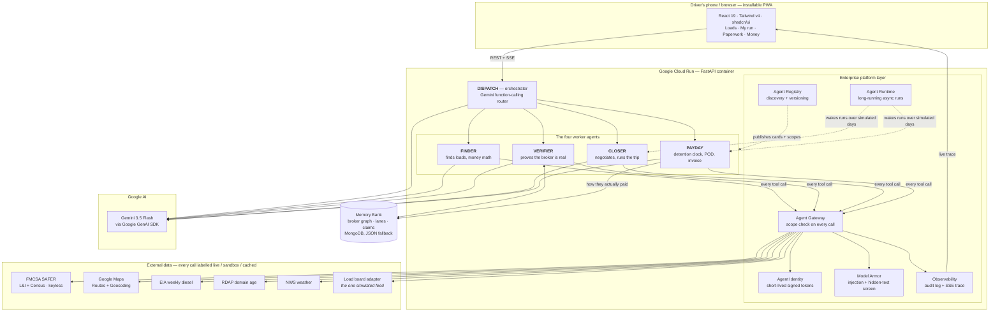

# Lumper Backstop — the freight desk that fights for you

**Track: The Fortified Enterprise Fleet.** Four agents and an orchestrator that
find a load, prove the broker is real against the live federal record, negotiate
it, run the trip, and then fight for every dollar the load actually earned —
including the hours the driver spent waiting at a dock. Every tool call is
discoverable, identity-checked, policy-routed, armored, and traced.

Built by **[Maze Builders LLC](https://mazebuilders.com)**, on the same problem our
real product solves:
small carriers lose real money to fraud and to unpaid detention because nobody
has time to chase it. Backstop is that chase, automated.

**Built with Google Gemini** · `gemini-3.5-flash` via the Google GenAI SDK ·
deployed on Google Cloud Run.

---

## The two problems, in money

**Waiting.** A driver reaches a dock, and the clock starts. The first two hours
are free; after that the broker owes detention. ATRI put the 2023 bill at
**$15.1 billion** — $3.6B direct, $11.5B in lost productivity — with drivers
detained on **39.3% of all stops**. **94.5% of fleets bill for detention, and
fewer than half those invoices get paid**, because nobody documented the arrival
properly. That gap is the product.

**Fraud.** **75–80% of US shipments** move through load boards, and double
brokering and fictitious pickups are among the most frequent US theft types.
Cargo theft losses hit an estimated **$725 million in 2025, up 60% in a year**.

Sources, with the figures we could *not* verify explicitly flagged: [`docs/STATS.md`](docs/STATS.md).

---

## What you see in three minutes

Open the app on a phone — it is one responsive PWA, installable, no app store.

1. **"Find me a load."** Finder pulls the board, prices every posting against real
   drive miles, real diesel, and this lane's history, and kills the ones that
   don't clear a profit. The highest-paying loads on the board are all traps.
2. **Tap one.** Verifier runs a live background check in front of you. It pulls
   the **real federal SAFER record** for that MC and diffs it, field by field,
   against what the posting claims.
3. **The catch.** The scam load posts under a *real* broker's docket, with a
   lookalike phone, email and domain:

   > `posting says 469-555-0177 · SAFER says 800-435-0940 · MISMATCH`
   > `469-555-0177 belongs to an entity registered 9 days ago`
   > `memory · same number Redline used, two days after Redline went dark`

   Refusing blacklists the impostor, not the real broker whose docket was hijacked.
4. **Take the clean one, drive, arrive.** Hitting *I'm at the dock* stamps a
   GPS-verified arrival. The free window burns down, the meter starts, and Payday
   emails the broker a timestamped notice at the boundary — *the document missing
   from every claim they ever denied* — then escalates on a real backoff and files
   the claim.
5. **Snap the paperwork.** Vision reads the POD, the GPS is matched against the
   delivery point, the invoice goes out, and the money comes back. The payment
   behaviour is written back to the graph, so Verifier is smarter next time.

Everything above runs against live services. Nothing on those screens is pre-written.

---

## The fleet

| Agent | Job | Tools it actually calls |
|---|---|---|
| **Dispatch** | Orchestrator + the chat you talk to | Gemini function-calling router, event bus, task scheduler, run state |
| **Finder** | Finds the money | Load-board adapters, ELD position + HOS, Maps Routes + Geocoding, EIA diesel by PADD, lane history, Gemini shortlist |
| **Verifier** | Proves the broker is real | **SAFER federal retrieval (keyless, live)**, posting-vs-registry cross-check, FMCSA QCMobile, callback-contact cross-check, RDAP domain age, Memory Bank recall, Model Armor, Document AI diff, Gemini verdict |
| **Closer** | Closes the deal | Lane comps anchor, Gemini counter-offer, bounded retry + backoff on broker silence, voice approval, Resend (allowlisted) / Outbox, locked-terms write, Routes + NWS reroute |
| **Payday** | Gets the money | GPS geofence detention clock, timestamped broker notice, bounded escalation + claim filing, Vision POD read + GPS match, invoice PDF + factoring packet, aging tracker, Gemini claim drafting |

**The closed loop.** Payday teaches Verifier — how a broker actually paid, and
whether they fought the detention claim, becomes next week's risk score. Verifier
teaches Finder — a refused broker is filtered before Finder spends an API call on
them. A load card will tell a driver *"they fought 3 waiting-time claims — hit
ARRIVED the second you're on their property."* Nobody wrote that sentence; it
falls out of the loop.

---

## Architecture



**The closed loop.** Payday records how a broker actually paid and whether they
fought the detention claim; Verifier reads it back on the next screen; Finder
never spends an API call on a broker Verifier refused. A load card telling a
driver *"they fought 3 waiting-time claims — hit ARRIVED the second you're on
their property"* is that loop, surfaced.

---

## Gemini Enterprise Agent Platform pillars

| Pillar | Where it lives | What it does |
|---|---|---|
| **Agent Registry** | `platform/registry.py`, Registry view | Discovery + versioning; publishes each agent's card and the scopes it may use |
| **Agent Identity** | `platform/identity.py` | Zero-trust: each agent holds a short-lived signed token that auto-renews before expiry |
| **Agent Gateway** | `platform/gateway.py` | Every tool call routes through one choke point that checks identity + scope, then traces it |
| **Model Armor** | `platform/armor.py` | Screens untrusted documents for prompt injection and hidden text **before** any model reads them |
| **Agent Runtime** | `platform/runtime.py` | Long-running async runs that survive simulated days, waking on events and schedules |
| **Memory Bank** | `platform/memory.py` | Persistent broker graph, lane history, and run state (MongoDB, JSON fallback) |
| **Observability** | `platform/observability.py`, Live trace | Every utterance, tool call, policy decision and armor verdict is streamed and audit-logged |

---

## What's real, and the one thing we simulate

Judges have seen a thousand fake demos, so here is the line.

**Live with no key at all:** the **SAFER federal record** (Licensing & Insurance
+ Motor Carrier Census) — the retrieval behind the callback cross-check — plus
**RDAP** domain age and **NWS** weather.

**Live the moment their free key is set:** Gemini, Google Maps Routes +
Geocoding, EIA diesel by PADD, FMCSA QCMobile.

**Real regardless of any key:** Model Armor, the zero-trust Gateway, the Memory
Bank graph write-back, the detention clock, and the full trace.

**Simulated: exactly one thing — the load-board feed.** DAT / Truckstop /
123Loadboard require signed vendor agreements, so the adapter layer is
production-shaped (`tools/loadboards.py`) and the sandbox replays a seeded board.
Set `LOADBOARD_ADAPTER=dat` with credentials and nothing else changes.

Every tool call surfaces its backend in the trace — `LIVE`, `SANDBOX`, `CACHED`
or `TEMPLATE` — so an estimate can never be mistaken for a measurement. Where the
phone times a detention clock itself because the desk is unreachable, it says
**ESTIMATE** on screen.

**Outbound email is off by default.** Live sending needs a key *and*
`MAIL_LIVE=true` *and* the recipient's domain on an allowlist, and reserved
sandbox domains are refused even then. Nothing in the demo emails a real person.

**On the MC numbers.** Every "fictional" docket in the seed was checked against
Licensing & Insurance and replaced until it returned empty. MC numbers are
allocated densely, and the originals belonged to real businesses and private
individuals — who would otherwise have appeared on stage, from a live federal
lookup, cast as a fraud ring. `data/seed.py` carries the curl to re-check.

No customer data is used. Broker names and domains are synthetic (`.example.*`).

---

## Run it

### Locally

```bash
git clone https://github.com/yordanoskassa/lumper_hack.git
cd lumper_hack
cp .env.example .env          # add any keys you have; all are optional
bash scripts/dev.sh
```

Backend → http://127.0.0.1:8787 · Frontend → **http://127.0.0.1:5180**

Use `127.0.0.1`, not `localhost` — `localhost` resolves to IPv6 first and any
other dev server on your machine may answer there instead.

The phone view is the same URL on your network, or add it to your home screen.
Requires Python 3.12 and Node 20+. MongoDB is optional; without it the Memory
Bank falls back to a JSON snapshot.

**Every key is optional.** With a key the tool runs live; without one the same
code path runs a labelled fallback, and the trace says which. `GEMINI_API_KEY`
is the only one worth setting for a first run — SAFER, RDAP, NWS and EIA diesel
are all live with no key at all.

### On Google Cloud Run

```bash
# one time — these need your own Google login
#   https://cloud.google.com/sdk/docs/install
gcloud auth login
gcloud config set project YOUR_PROJECT_ID

export GEMINI_API_KEY=...          # and optionally GOOGLE_MAPS_API_KEY, MONGO_URI
bash scripts/deploy.sh
```

The script enables Cloud Run, Cloud Build and Vertex AI, builds
`backend/Dockerfile` from source, deploys the service, and prints the live URL.
Secrets are passed as deploy-time environment variables and never baked into the
image. `MAIL_LIVE` stays `false`: these agents draft and send on their own
initiative, and live sending additionally requires a key *and* the recipient's
domain on an allowlist.

Point the frontend at the deployed backend:

```bash
VITE_API_BASE=https://YOUR-SERVICE.run.app npm --prefix frontend run build
```

### As a public site — Netlify + EasyPanel

The frontend deploys to Netlify ([`netlify.toml`](netlify.toml) is already
wired) and the backend container to EasyPanel; point `VITE_API_BASE` at the
backend and rebuild. Step-by-step: [`docs/DEPLOY.md`](docs/DEPLOY.md).

### Demo

[`docs/DEMO.md`](docs/DEMO.md) walks the whole flow and names, for each step,
the tab that holds the artifact proving it.

**Stack** (same as our production app): FastAPI · Google GenAI SDK ·
Gemini 3.5 Flash · MongoDB (motor) · httpx · ReportLab · React 19 + Vite +
TypeScript + Tailwind v4 + shadcn/ui · deployed on Google Cloud Run.

---

<div align="center">

**Lumper Backstop** — built with Google Gemini for the All Things Agentic Hackathon
(Fortified Enterprise Fleet).

© 2026 **[Maze Builders LLC](https://mazebuilders.com)**. All rights reserved.

</div>
